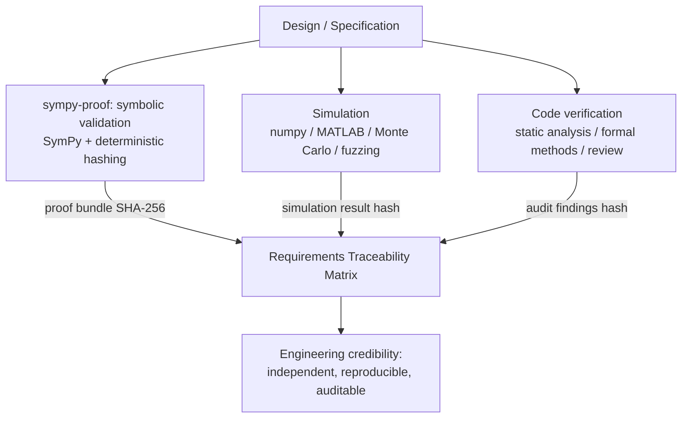
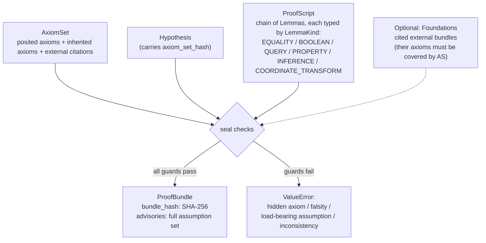

# sympy-proof

Symbolic proof authoring for dynamical system specifications. SymPy-based theorem-style verification of system properties.

Declare axioms, bind hypotheses, build lemma chains, and seal reproducible hashed proof bundles. Every sealed proof gets a deterministic SHA-256 hash — same inputs, same hash, every time.

Maintained by Dynamical Systems Group. Complements [MSML](https://github.com/DynamicalSystemsGroup/MSML) (mathematical specification authoring) and [gds-core](https://github.com/DynamicalSystemsGroup/gds-core) (simulation runtime). Together they form a three-layer V&V stack: specify, simulate, prove.

## Verification vs. Validation

The most expensive failures in engineering happen when you **correctly implement the wrong thing**.

- Therac-25: software faithfully executed the control algorithm. The algorithm's concurrency model was flawed. Patients died.
- Mars Climate Orbiter: code correctly computed trajectory. The specification mixed imperial and metric units. $327M lost.
- Boeing 737 MAX MCAS: the flight control software correctly implemented the specified augmentation law. The specification's reliance on a single sensor was the design flaw. 346 deaths.

Mature fields (aerospace, medical devices, nuclear) solved this decades ago with an explicit split:

| | Question | Failure mode if skipped |
|---|---|---|
| **Verification** | Did we build the thing right? (code matches spec) | Implementation bugs |
| **Validation** | Did we build the right thing? (spec has the properties we need) | Correct code, wrong behavior |

Most formal methods tools are **verification** tools — they prove code matches a specification. But if the specification is flawed, correct code still fails.

**sympy-proof is primarily a validation tool.** It works at the formula level, not the code level. "Does this control law actually stabilize the plant?" is a math question. "Does rounding error accumulate in the right direction across a pipeline?" is a math question. "Does this invariant hold under the claimed parameter range?" is a math question. These are questions about whether the *design* is correct — before any code is written.

### Why you need all three layers

Each layer of testing has blind spots the others cover. No single layer gives you a complete picture — together they give you a three-dimensional view of system correctness.

**Symbolic analysis** (sympy-proof) surfaces the assumptions your algorithms make about things the code cannot control — user behavior, input distributions, environmental conditions, parameter ranges. These assumptions live in the math, not in the code. A controller that's provably stable for J > 0 will fail if the moment of inertia estimate is wrong. A pricing-curve invariant that holds for 0 < fee < 1 breaks if the fee parameter is set to zero. Code review won't catch this because the code correctly implements the formula. Integration tests might miss it because they test the happy path. Only symbolic analysis forces you to enumerate what you're assuming and check whether those assumptions actually hold.

**Numerical simulation** catches what symbolic analysis can't: finite-precision effects, noise sensitivity, parameter uncertainty, edge cases at domain boundaries. Your formula might be symbolically correct but numerically unstable. Monte Carlo testing reveals the gap between the idealized model and the messy reality.

**Implementation verification** catches what both miss: did the code actually implement the formula it claims to? Typos, off-by-one errors, wrong function calls, concurrency bugs — these have nothing to do with the math and everything to do with the translation from specification to code.

| Layer | Blind spot | What it misses |
|---|---|---|
| **Symbolic** (sympy-proof) | Assumes exact arithmetic, idealized conditions | Floating-point errors, noise, real-world parameter variation |
| **Simulation** | Tests specific scenarios, not all of them | Edge cases outside the test distribution, systematic design flaws |
| **Verification** | Proves code matches spec — but the spec might be wrong | Mathematical errors in the design, wrong assumptions about the environment |

Each layer is necessary. None is sufficient. The expensive failures happen in the gaps between layers — a mathematically flawed design that passes code review, a numerically unstable formula that passes symbolic analysis, a correctly-implemented spec that nobody validated against reality.

### The three-layer architecture

| Layer | Role | Proves | Tool |
|---|---|---|---|
| **Validation** (sympy-proof) | Is the math right? | Formulas have the behavioral properties designers expect | SymPy + deterministic hashing |
| **Simulation** | Does it work in practice? | Properties hold under finite precision, noise, parameter variation | numpy, MATLAB, Monte Carlo, fuzzing |
| **Verification** | Is the code right? | Production code matches the validated model | Static analysis, formal verification, code review |

sympy-proof covers the first layer. It proves that the *formula* has the properties you think it has — not that the *code* implements the formula correctly, and not that the formula behaves well under conditions you haven't modeled. Crucially, it makes the assumptions explicit: every axiom in a proof bundle is a condition the design depends on. If those conditions don't hold in deployment, the proof is still valid — but the system will still fail.

The innovation is **binding all three layers via cryptographically traceable evidence trees.** Each sealed proof bundle gets a deterministic SHA-256 hash. That hash goes into a requirements traceability matrix alongside simulation results and code audit findings. Any reviewer can re-run the proof and get the identical hash — independent, reproducible evidence.



The [satellite ADCS example](symproof/library/examples/control/04_composition.py) demonstrates the full pattern: three independent proofs (controllability, observability, Lyapunov stability) composed into a single sealed bundle, with an explicit hash mapped to a stability requirement in the V&V matrix.

### What sympy-proof proves (validation)

- A Lyapunov function exists (the model is actually stable — under the stated assumptions)
- The characteristic polynomial is Hurwitz (all roots in the left half-plane)
- Rounding error is bounded AND accumulates in the correct direction
- Intermediate products don't overflow machine word sizes
- A boolean circuit's output entropy quantifies information leakage
- An LP solution satisfies optimality conditions (KKT / duality)
- A continuous function on a compact set attains its maximum (EVT)
- A market-mechanism invariant holds under the claimed fee structure

### What sympy-proof does NOT prove

- Production code matches the proven formula → **verification** (formal verification, code review)
- The formula behaves under parameter uncertainty → **simulation** (Monte Carlo, fuzzing)
- The system is robust to unmodeled dynamics → **testing** (hardware-in-the-loop, integration tests)
- Runtime inputs stay within the proven bounds → **monitoring** (runtime checks, assertions)
- The axioms actually hold in deployment → **domain expertise** (the proof is only as good as its assumptions)

These gaps are covered by the other layers. sympy-proof's proofs are **necessary but not sufficient** — they establish that the design is mathematically sound and its assumptions are explicit, before simulation tests it under stress and code analysis verifies the implementation.

### Hidden axioms: the silent failure mode

There is a failure mode more subtle than wrong code or flawed specifications: **citing a theorem without accounting for its assumptions**.

A controls engineer applies a stability theorem. The theorem requires Lipschitz continuity of the gradient. The engineer's system has discontinuities at saturation boundaries. The proof is correct; the application is not. A financial engineer uses a convergence result from stochastic optimization. The result requires bounded stochastic gradients. The engineer's model has heavy-tailed noise. The citation is valid; the conditions are violated.

This is the **hidden axiom problem**: when you invoke a result, you inherit all of its assumptions. If those assumptions are not explicitly declared and validated for your specific setting, your proof has a soundness gap that no amount of algebraic verification will catch.

Hidden axioms are a major source of failures in practice, especially among scientists and engineers who cite theorems without carefully interrogating their implicit conditions — or at minimum, confirming that those conditions are appropriate simplifications for their application. The theorem is correct. The axioms hold in the abstract. But the specific system violates a condition that was never checked because it was never surfaced.

sympy-proof addresses this with **foundation enforcement**: when a proof depends on an external theorem, `seal()` requires a foundation bundle that makes the theorem's assumptions explicit. Every assumption in the foundation must appear in the downstream proof's axiom set — either as a posited axiom (a modelling choice) or as an inherited axiom (a condition the proof chain forced). Missing assumptions are flagged as hidden axioms and `seal()` refuses to proceed.

```python
# This fails — foundation has axioms not declared in downstream
bundle = seal(axioms, hypothesis, script,
              foundations=[(convergence_proof, "convergence_theorem")])
# ValueError: Foundation has axioms not present in axiom set:
#   ['bounded_gradient', 'lipschitz_continuity']. These are hidden axioms.

# Fix: declare the inherited axioms explicitly
axioms = AxiomSet(name="system", axioms=(
    Axiom(name="my_constraint", expr=x > 0),                          # posited
    Axiom(name="convergence_theorem", expr=sympy.S.true),              # external
    Axiom(name="bounded_gradient", expr=gamma > 0, inherited=True),    # inherited
    Axiom(name="lipschitz_continuity", expr=L > 0, inherited=True),    # inherited
))
```

The `inherited=True` flag is semantically meaningful: it distinguishes conditions the proof author chose from conditions the proof chain forced. Both are required for soundness, but inherited axioms trace back to a specific external result rather than a design decision. This makes the full assumption set visible and auditable.

See the [DIP routing demonstration](symproof/library/examples/dip_routing/) for a worked example where this process revealed three hidden axioms in a published convergence proof.

### Why this matters

An engineer designs a controller. A programmer implements it. But nobody proves the engineer's math actually has the stability properties the design review claims. A protocol designer writes a mechanism. An auditor verifies the code. But nobody proves the designer's formulas actually preserve the invariants under adversarial conditions.

This is the gap where the most expensive failures live — and it's the gap sympy-proof fills.

The goal: an open-source verification and validation stack where symbolic proofs, simulation results, and code audit findings are all independently reproducible, cryptographically linked, and traceable to requirements.

## Features

- **Reproducible proofs** — Every proof is hashed. Share the hash as a receipt; anyone can re-verify.
- **Composable** — Import sealed proofs as building blocks. Prove `A`, prove `B`, then import both into a proof of `C`.
- **Hidden axiom detection** — When a proof depends on an external theorem, `seal(foundations=...)` enforces that all of the theorem's assumptions are declared. Missing assumptions are a hard error.
- **Inherited vs. posited axioms** — `Axiom(inherited=True)` marks conditions that came from a foundation proof, not from the proof author. The full assumption provenance is traceable.
- **Evaluation control** — `unevaluated()` preserves expression structure during construction; `evaluation()` gates when simplification actually happens. No hidden eager evaluation.
- **Citation tracking** — Inherited axioms require `Citation(source="...")` for provenance. The full assumption chain is traceable from proof to external source.
- **Falsity and consistency guards** — `seal()` rejects provably false axioms and contradictory axiom pairs. Load-bearing symbol assumptions without matching axioms are a hard error.
- **Advisory system** — Every sealed proof reports its full assumption set (posited, inherited, external) plus SymPy limitation flags for human review.
- **False-positive protection** — `seal()` rejects proofs where lemma assumptions contradict axioms. Axioms are authoritative.

## Install

```bash
uv add symproof
```

## Quick Start

```python
import sympy
from symproof import Axiom, AxiomSet, ProofBuilder, LemmaKind, seal

x, y = sympy.symbols("x y")

axioms = AxiomSet(name="positive_reals", axioms=(
    Axiom(name="x_positive", expr=x > 0),
    Axiom(name="y_positive", expr=y > 0),
))

h = axioms.hypothesis("product_positive", expr=x * y > 0)

script = (
    ProofBuilder(axioms, h.name, name="pos_product", claim="x*y > 0")
    .lemma("xy_positive", LemmaKind.QUERY,
           expr=sympy.Q.positive(x * y),
           assumptions={"x": {"positive": True}, "y": {"positive": True}})
    .build()
)

bundle = seal(axioms, h, script)
print(bundle.bundle_hash)  # deterministic 64-char SHA-256
```

What `seal()` actually produces:



The guards (`seal()` rejects if any fail):
- **Foundation coverage** — every axiom of every cited foundation appears in the downstream `AxiomSet` (as posited or inherited)
- **Falsity check** — no axiom whose `simplify(expr)` is `False`
- **Pairwise consistency** — no axiom pair whose conjunction simplifies to `False`
- **Load-bearing accounting** — symbol-level assumptions (`positive=True`, etc.) that affect verification must appear as named axioms

## Examples

Graduated examples in [`examples/`](examples/), each self-contained and runnable:

| File | What it teaches |
|------|----------------|
| [`01_first_proof.py`](examples/01_first_proof.py) | Simplest proof: Euler's identity e^(ipi)+1=0 |
| [`02_series_and_sums.py`](examples/02_series_and_sums.py) | Infinite series, closed-form sums, advisory system |
| [`03_multi_lemma_proof.py`](examples/03_multi_lemma_proof.py) | Decomposing AM-GM into a chain of lemmas |
| [`04_using_the_library.py`](examples/04_using_the_library.py) | Importing pre-built proofs, composition |
| [`05_control_engineering.py`](examples/05_control_engineering.py) | Plant + controller stability, Lyapunov construction |
| [`06_latex_export.py`](examples/06_latex_export.py) | LaTeX views of proofs — pipe to file for compilable .tex |
| [`conviction_voting.ipynb`](examples/conviction_voting.ipynb) / [`.py`](examples/conviction_voting.py) | Storyboard walkthrough on a continuous-aggregation governance mechanism: framing axioms, hidden-assumption hunting, two failure-and-fix moments |

Run any example:

```bash
uv run python examples/01_first_proof.py
```

### Tutorial notebook

[`examples/conviction_voting.ipynb`](examples/conviction_voting.ipynb) is a guided walkthrough: how to apply sympy-proof to an unfamiliar domain, how `seal()`'s load-bearing checks surface hidden assumptions, and how to recover from proof-construction failures. Read this if "what does sympy-proof feel like in practice?" is your question.

Install notebook deps and open in JupyterLab:

```bash
uv sync --group notebooks
uv run jupyter lab examples/conviction_voting.ipynb
```

## Proof Library

Pre-built, reusable proof bundles organized by domain. Import them into your proofs via `ProofBuilder.import_bundle()`.

### Core (`symproof.library.core`)

| Function | Proves |
|----------|--------|
| `max_ge_first(ax, a, b)` | Max(a, b) >= a |
| `piecewise_collapse(ax, expr, cond, fb)` | Piecewise collapses to active branch |

### Envelope Theorem (`symproof.library.envelope`)

| Function | Proves |
|----------|--------|
| `envelope_theorem(ax, f, x, theta)` | Danskin's envelope theorem: dV/dtheta = df/dtheta at the maximiser |

### Control Systems (`symproof.library.control`)

| Function | Proves |
|----------|--------|
| `hurwitz_second_order(ax, a2, a1, a0)` | 2nd-order polynomial is Hurwitz stable |
| `hurwitz_third_order(ax, a3, a2, a1, a0)` | 3rd-order Routh-Hurwitz |
| `closed_loop_stability(ax, G_n, G_d, C_n, C_d, s)` | Plant + controller closed-loop is stable |
| `lyapunov_stability(ax, A, P, Q)` | Verify Lyapunov equation A^T P + PA + Q = 0 |
| `lyapunov_from_system(ax, A)` | **Construct** P and prove stability |
| `gain_margin(ax, coeffs, K, s)` | Gain below critical => stable |
| `controllability_rank(ax, A, B)` | System (A,B) is controllable |
| `observability_rank(ax, A, C)` | System (A,C) is observable |
| `quadratic_invariant(ax, states, dots, V)` | dV/dt = 0 along trajectories |

### Fixed-Point Numerics (`symproof.library.defi`)

Fixed-point arithmetic primitives with explicit rounding direction. Useful for any setting where finite-precision rounding behavior matters — smart-contract audits, embedded systems, monetary calculations, signal-processing pipelines.

| Function / Class | Proves |
|------------------|--------|
| `mul_down`, `mul_up`, `div_down`, `div_up` | Floor/ceil fixed-point ops with explicit rounding direction |
| `rounding_bias_lemma(a, b, s)` | ceil >= floor (UP always >= DOWN) |
| `rounding_gap_lemma(a, b, s)` | ceil - floor <= 1 (max 1 unit extraction per op) |
| `directional_chain_error(steps)` | Per-step sign + net flow direction across a pipeline |
| `chain_error_bound(exact, trunc)` | Cumulative rounding error < N over N operations |
| `phantom_overflow_check(a, b, d)` | a*b overflows uint256 (mulDiv required) |
| `no_phantom_overflow_check(a, b)` | a*b fits in uint256 (naive path safe) |
| `DecimalAwarePool(rx, ry, dec_x, dec_y)` | Cross-decimal normalization (e.g., USDC/6 ↔ WETH/18) |
| `fee_complement_positive(ax, fee)` | 1 - fee > 0 from 0 < fee < 1 |
| `amm_output_positive(ax, Rx, Ry, fee, dx)` | Constant-product market output > 0 |
| `amm_product_nondecreasing(ax, Rx, Ry, fee, dx)` | Product invariant grows with fees |

Run the walkthrough: `uv run python -m symproof.library.examples.defi.01_amm_swap_audit`

### Convex Optimization (`symproof.library.convex`)

| Function | Proves |
|----------|--------|
| `convex_scalar(ax, f, x)` | f''(x) >= 0 (scalar convexity) |
| `convex_hessian(ax, f, vars)` | Hessian PSD via Sylvester's criterion |
| `strongly_convex(ax, f, vars, m)` | Hessian eigenvalues >= m > 0 |
| `unique_minimizer(ax, f, vars, m)` | Strong convexity implies unique minimum |
| `conjugate_function(ax, f, x, y)` | Fenchel conjugate f* and its convexity |
| `convex_composition(ax, f, g_list)` | DCP composition rules |

### Physics (`symproof.library.physics`)

| Function | Proves |
|----------|--------|
| `constant_acceleration(ax, x0, v0, a, t)` | v = dx/dt, a = dv/dt from x(t) |
| `shm_solution_verify(ax, A, omega, phi, t)` | x(t) satisfies x'' + omega^2 x = 0 |
| `shm_energy_conservation(ax, m, k, A, omega, phi, t)` | dE/dt = 0 for SHM |
| `work_energy_theorem(ax, F, m, v0, a, t)` | W = delta(KE) |
| `gravitational_potential_from_force(ax, G, M, m, r)` | F = -dU/dr |

### Linear Optimization (`symproof.library.linopt`)

| Function | Proves |
|----------|--------|
| `feasible_point(ax, A, b, x)` | Ax = b, x >= 0 |
| `dual_feasible(ax, A, c, y, z)` | A^T y + z = c, z >= 0 |
| `strong_duality(ax, c, b, x, y)` | c^T x = b^T y |
| `lp_optimal(ax, c, A, b, x, y, z)` | Composed: primal + dual + duality => optimal |
| `integer_feasible(ax, A, b, x)` | Ax = b, x >= 0, x integer |

### Point-Set Topology (`symproof.library.topology`)

| Function | Proves |
|----------|--------|
| `verify_open(ax, S)` | Set is open |
| `verify_closed(ax, S)` | Set is closed (complement open) |
| `verify_compact(ax, S)` | Heine-Borel: closed + bounded => compact |
| `continuous_at_point(ax, f, x, a)` | lim f(x) = f(a) as x -> a |
| `intermediate_value(ax, f, x, a, b, target)` | IVT: sign change implies root |
| `extreme_value(ax, f, x, a, b)` | EVT: max and min on closed interval |

### Boolean Circuits (`symproof.library.circuits`)

| Function | Proves |
|----------|--------|
| `gate_truth_table(ax, expr, vars, expected)` | Gate matches truth table |
| `circuit_equivalence(ax, A, B, vars)` | Two circuits compute same function |
| `r1cs_witness_check(ax, A, B, C, witness)` | Witness satisfies R1CS constraints (ZK) |
| `boolean_entropy(ax, expr, vars)` | Output entropy of boolean function |

### Shannon Information Theory (`symproof.library.information`)

| Function | Proves |
|----------|--------|
| `entropy(ax, probs)` | H(X) = -sum p_i log2(p_i) |
| `mutual_information(ax, joint_probs)` | I(X;Y) = H(X) + H(Y) - H(X,Y) |
| `kl_divergence(ax, p, q)` | D(P\|\|Q) with Gibbs' inequality |
| `binary_symmetric_channel(ax, p)` | BSC capacity C = 1 - H(p) |

## Verification Strategies

sympy-proof dispatches on `LemmaKind`:

| Kind | How it verifies | Use when |
|------|----------------|----------|
| `EQUALITY` | `simplify(expr - expected) == 0` | Algebraic identities, series |
| `BOOLEAN` | `simplify(expr) is True`, with `refine()` fallbacks | Implications, inequalities |
| `QUERY` | `sympy.ask(expr, context)` | Positivity, type queries |
| `PROPERTY` | `getattr(expr, property_name)` is truthy | Topological/structural properties |
| `INFERENCE` | Non-empty `depends_on` + non-empty `rule` | Logical conclusions from premises |
| `COORDINATE_TRANSFORM` | Round-trip + transform + simplify | Polar/hyperbolic coordinate proofs |

## Development

```bash
uv sync
uv run python -m pytest tests/ -v
uv run ruff check symproof/
```

## Engineering principles encoded in this tool

Five commitments shape sympy-proof's design. They are distilled from observing how high-consequence systems actually fail in industrial practice, and they generalize beyond formal-methods tooling to any V&V practice that aspires to engineered accountability.

**Validation precedes verification.** The most expensive engineering failures happen not when code mismatches its specification, but when the specification itself is wrong. Most formal-methods tooling addresses the former. sympy-proof addresses the latter. Verification operates on the code after it is written; validation operates on the math before any code exists. A practice that emphasizes only verification will reliably ship correct implementations of flawed designs — exactly the failure mode that characterizes Therac-25, the Mars Climate Orbiter loss, and the Boeing 737 MAX MCAS incidents. sympy-proof's foundational design choice is to make validation the explicit, separately-tooled layer that those failure modes demand.

**Assumptions must be explicit to be auditable.** Every proof holds under a set of conditions. When those conditions are unstated, downstream readers cannot tell whether the proof's conclusions apply to their setting. The `Axiom` type makes assumptions structural: every assumption is named, typed, and tracked. The `inherited=True` flag distinguishes assumptions the proof author chose (modelling commitments) from assumptions the proof chain forced (preconditions of cited results) — both are required for soundness, but they have different review implications. The design conviction: an unaudited assumption is a soundness gap that no amount of algebraic verification will catch.

**Hidden axioms are the dominant failure mode in practice.** The recurring failure pattern in engineering papers and industrial proofs is not algebraic error — it is citing a theorem without confirming its preconditions in the new setting. A controls engineer applies a stability result that requires Lipschitz continuity to a system with saturation discontinuities. A financial engineer invokes a convergence theorem requiring bounded stochastic gradients on a model with heavy-tailed noise. Both citations are correct in the abstract and wrong in the application. The `foundations=[...]` mechanism in `seal()` enforces that every assumption of every cited theorem is explicitly inherited or re-justified, making this class of failure surface at proof-construction time rather than at deployment.

**Accountability is structural, not reputational.** Every sealed proof carries a deterministic SHA-256 hash. Two independent reviewers running the same proof under the same axiom set produce the same hash. That hash goes into a requirements traceability matrix alongside simulation evidence and code-audit evidence. Accountability is then *locatable*: a specific hash, traceable to specific axioms, traceable to specific human approvers. This is meaningfully different from "the team reviewed the proof." The structural form makes the accountability chain auditable by anyone — including the team's future selves at the moment of an incident review.

**Three layers of evidence are necessary; none alone is sufficient.** Symbolic proofs, numerical simulation, and code-level verification each catch failure modes the others miss. Symbolic analysis assumes exact arithmetic and idealized conditions — misses floating-point error, noise, parameter variation. Simulation tests specific scenarios — misses systematic design flaws outside the test distribution. Code verification proves code matches spec — misses errors in the spec itself. Each layer is necessary; none alone is sufficient. The cryptographically-traceable evidence chain that *links* the three layers is what produces engineering credibility, not any single layer's strength taken in isolation.

These design commitments reflect DSG's broader posture on V&V for high-consequence systems: a preference for restraint-first, audit-first tooling that surfaces uncertainty rather than concealing it, and that makes the chain of human accountability visible at the structural level rather than relying on institutional trust.

## Related work at DSG

sympy-proof sits at the validation layer of a three-layer V&V stack maintained by Dynamical Systems Group:

- [MSML](https://github.com/DynamicalSystemsGroup/MSML) — Mathematical Specification Modeling Language. Authoring environment for the formulas sympy-proof verifies.
- [gds-core](https://github.com/DynamicalSystemsGroup/gds-core) — Generalized Dynamical Systems simulation runtime. Numerical-simulation layer; consumes the same models sympy-proof proves properties about.
- [dynamical-block-diagrams](https://github.com/DynamicalSystemsGroup/dynamical-block-diagrams) — Diagrammatic notation for dynamical systems; supports both specification and exposition.
